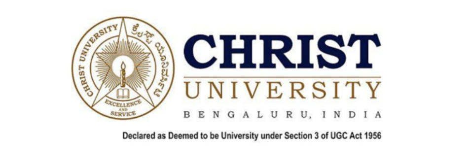
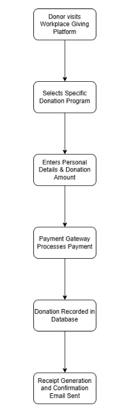
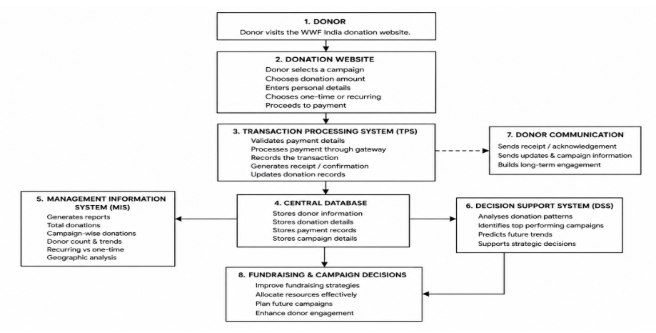
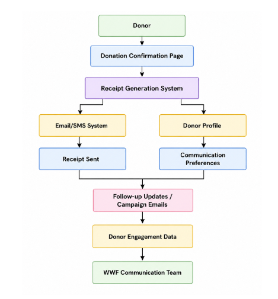
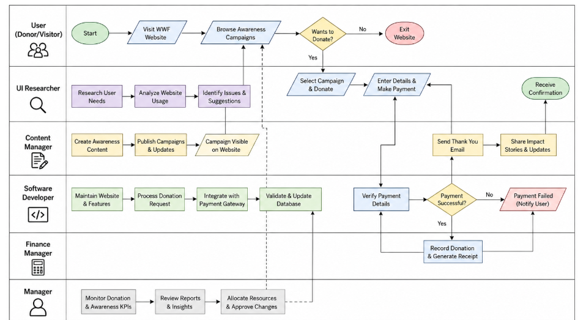

# Digital Information Systems Analysis of WWF India's Donation Management Platform

# CIA-2: Digital Business Systems

**Course Code:** ECD223-3

**Faculty:** Dr. Chandravesh Chaudhari

**Institution:** CHRIST (Deemed to Be University)

**Submitted By:**

- Megan Anriya Dcruz (2533334)
- Agasthithayaagaran Saravanen (2533303)
- Esha Naidu (2533325)
- Anshuman Vasisht (2533309)
- Uppalapati Harshith (2533359)

---

## 1. Organization Overview: WWF (World Wildlife Fund)

### 1.1 Nature of Business

Founded in 1961, this Switzerland-based NGO and advocacy group for wildlife, the World Wildlife Fund (WWF), works for a sustainable relationship between humans and the environment. As the largest conservation group on the planet, WWF protects the mountains, wetlands, rivers, savannas and the ocean on nearly every continent in close to 100 countries. Unlike profit-driven organizations, WWF relies heavily on public donations, with funds being reinvested into its conservation initiatives rather than distributed as profit. Through its donation platform, WWF enables individuals to directly support conservation efforts and contribute to building a future in which humans live in harmony with nature.

### 1.2 Business Model

WWF developed a multi-stream funding model to cover its global operational costs. Around 65% of the funding comes from donations and wills, 17% from governmental funding, including the World Bank and USAID, and 8% from the corporate sector. Donations are obtained through one-off donations, monthly memberships, such as the "WWF Heroes" program, legacies, and fundraising events. Several sponsored events, like marathons and cycles, also raise a good amount of funding. WWF collaborates with IKEA, Canon, and Coca-Cola for sustainability and supply chain goals. Additionally, it sells online conservation-related goods and supports the symbolic adoptions of animals. WWF invested over $400 million in conservation in FY24, with 84% of all spending directed toward global efforts to protect nature and build climate resilience, and net assets rose to $645 million. This strong financial stewardship reinforces donor trust and institutional credibility.

### 1.3 Digital Business Ecosystem

WWF has created a digital business ecosystem that uses a variety of interlinked digital tools to drive their fundraising and conservation activities. Their main digital platform, worldwildlife.org, which is built using the Wagtail open source CMS, and contains over 6,000 pages and stories about conservation, receiving 10 million visitors. WWF manages donor relations using Salesforce CRM, where WWF Netherlands houses over 1.1 million supporters, across various relationships, interests, and mindsets. WWF also uses SAS Customer Intelligence 360 to run advanced analytics, Machine Learning pipelines, and models are used to identify the right marketing channel for each individual donor. WWF has also begun integrating generative AI capabilities through Amazon Bedrock to further refine its outreach. On the conservation technology front, Wildlife Insights, developed in partnership with Google, is a revolutionary platform where NGOs, governments, and citizen scientists can upload, analyze, and process AI-enabled camera trap photography. The AI is capable of identifying hundreds of species in minutes rather than the weeks it once took manually. WILDLABS.NET is a community engagement digital platform that offers an ecosystem to conservationists and scientists. WWF uses Stripe, MobilePay, and OnlineFundraising for payment processing and uses Facebook, Instagram, YouTube, and X for digital promotion, advertising and peer to peer fundraising.

### 1.4 Target Customers

WWF has over 4 million supporters in the world and nearly 1.2 million members in the US. WWF's stakeholders and supporters globally and regionally segmented in varied groups ranging from small monthly donors to major legacy givers. WWF distinguishes between long-time loyal supporters who prefer traditional engagement channels and younger audiences reached through modern digital-first strategies, tailoring communications accordingly. They use different means of accessing their corporate partners. These sustainability collaborators are seen as partners. They use targeted means of influencing to access governments and intergovernmental groups. WWF serves researchers and conservation professionals through Wildlife Insights and WILDLABS. WWF also uses digital campaigns and youth-led advisory roles to recruit the younger audience as future supporters and advocates of the organization. These audiences and stakeholders are interrelated and sustain WWF conservation missions through funding and support at a global level.

## 2. Information and Decision-Making

### 2.1 Data, Information, Knowledge and Wisdom

The "Donate to WWF-India" page is the primary data collection point of the entire donation platform. Every time a donor fills out and submits the form on this page, a rich set of raw data is captured – full name, email address, phone number, residential address, PIN code, city, state, nationality, identification type (Aadhaar, PAN Card, or Passport), date of birth, donation amount, donation type (one-time or monthly recurring), and even the source that inspired the donor to give, such as a Google search, social media appeal, emailer, YouTube, or a friend's recommendation. Each of these individual fields is a raw data point with limited meaning in isolation. A single ₹5,000 one-time donation from a donor in Karnataka who found the page through Google tells us very little on its own.

However, when hundreds and thousands of such form submissions are aggregated and organized, they become meaningful information – for example, monthly totals of one-time versus recurring donations, the most common donation amounts selected from the preset options of ₹25,000, ₹10,000, and ₹5,000, or the geographic distribution of donors across Indian states. Over time, this information develops into organizational knowledge. WWF India may come to understand that donors referred via social media tend to make larger one-time donations, while those who arrive through email newsletters are more likely to opt for monthly recurring contributions of ₹750, ₹1,500, or ₹2,000. They may also observe that donors from certain states are more likely to complete the form with a PAN Card number, suggesting a stronger motivation to claim tax exemption under Section 80G. When this knowledge begins to shape decisions — such as investing more in email campaigns to drive recurring donations, or tailoring social media appeals to maximize one-time gift values — it crosses into organizational wisdom. The entire DIKW (Data Information Knowledge Wisdom) hierarchy is therefore embedded within the functioning of this single donation page.

### 2.2 Types of Data and Information Quality

The "Donate to WWF-India" page generates several distinct categories of data simultaneously. Personal and identity data includes the donor's full name, contact details, address, nationality, and government identification all of which are legally required under Indian Income Tax Department rules for issuing Section 80G tax exemption certificates. This makes data accuracy in this category especially critical, as even a minor error in a PAN Card number or address can invalidate a tax receipt and cause significant inconvenience to the donor. Financial transaction data covers the donation amount, frequency (the page offers both one-time and monthly giving options), and payment method. The page also captures behavioural and referral data through the "What inspired you to give?" dropdown, which includes options such as Appeal on Social Media/Online Appeal, Emailer, E-newsletter, Face to Face Interaction, Family/Friend's Recommendation, Google Search, News/Media, Phone Call, YouTube, and WWF Website giving WWF India direct insight into which outreach channels are driving donations. Website analytics running in the background further add session-level data such as time spent on the page, device type, and drop-off points in the form.

The quality of information produced by this page has direct consequences for operations and trust. If a donor submits an incorrect email address, WWF India cannot deliver the acknowledgment email or tax receipt, potentially losing a recurring donor. If phone numbers are invalid, follow-up calls by representatives of one of the listed referral sources become impossible. Duplicate donor records created by the same user submitting the form multiple times can distort fundraising reports and inflate donor counts. The page's disclaimer "Donation options are indicative and funds will be utilized for conservation purpose wherever required the most", also means that donors must trust WWF India to manage their contributions responsibly, making the reliability and transparency of the underlying information system a matter of institutional credibility, not just operational efficiency.

### 2.3 How Information Quality Affects Managerial Decisions

The quality of information generated through the "Donate to WWF-India" page has a direct and measurable impact on the decisions made at every level of management within WWF India's fundraising operations. When the data collected is accurate, complete, and timely, managers are empowered to make confident, well-informed decisions. When it is not, even well-intentioned managerial decisions can lead to wasted resources, missed opportunities, and reputational harm.

At the most immediate level, poor information quality affects operational managers responsible for donor communications and transaction processing. If a donor submits an incorrect email address or phone number on the form, the operations team loses the ability to send acknowledgment emails, tax receipts, and campaign updates disrupting what should be a seamless post-donation experience. If PAN Card details are entered incorrectly, the Section 80G tax certificate cannot be issued accurately, which may cause donors to lose faith in the platform and choose not to donate again. Managers overseeing donor retention cannot make reliable decisions about follow-up schedules or re-engagement strategies if the underlying donor database is filled with duplicate entries, incomplete records, or outdated contact information.

At a mid-level, marketing and campaign managers rely heavily on the referral source data captured through the "What inspired you to give?" field on the page which includes options such as Google Search, Social Media Appeal, Emailer, and YouTube. If donors skip this field or select inaccurate options, the resulting information becomes misleading. A campaign manager looking at this data to decide whether to increase spending on Google Ads or double down on email newsletters would be making a significant budget decision on a flawed foundation. Similarly, if the split between one-time and monthly donor selections is misrecorded due to a technical error on the form, managers may incorrectly conclude that recurring giving is more or less popular than it actually is, leading to a misaligned fundraising strategy.

### 2.4 Operational and Strategic Decision-Making

At the operational level, the data collected through the "Donate to WWF-India" page directly drives a series of routine but critical tasks. Once a donation is submitted, the system must confirm the transaction, issue a receipt, and send a thank-you email to the donor all of which depend on the accuracy of the personal data entered in the form. For donors who select the monthly giving option, the platform must process recurring payments at ₹750, ₹1,500, or ₹2,000 per month without requiring the donor to re-enter their details each time, which requires reliable storage and retrieval of donor information. The "willing to be contacted" consent checkbox on the form governs whether WWF India can reach out to donors for programme updates or repeat contribution requests, making it an operationally significant data point that shapes future communications. Failed or incomplete form submissions where a donor may have dropped off before clicking the Donate button also generate data that the operations team can act on through retargeting or follow-up outreach.

At the strategic level, the aggregated information from this page informs much larger decisions about the direction of WWF India's digital fundraising efforts. The referral source data collected through the "What inspired you to give?" field, for instance, provides direct evidence of which acquisition channels are most effective, allowing leadership to make informed budget allocation decisions across Google Ads, social media, email campaigns, and field representative programmes. The split between one-time and monthly donors visible from the page's two giving modes — with preset one-time amounts of ₹5,000 to ₹25,000 and monthly options starting at ₹750 — informs decisions about how to position future fundraising appeals and whether to adjust the suggested donation amounts to better match donor behaviour. More broadly, the volume and consistency of donations through this general "Donate to WWF-India" page, compared to the six specific campaign pages, helps leadership decide how much emphasis to place on cause-neutral giving versus campaign-specific fundraising in their overall digital strategy. Every strategic decision, from redesigning the form to launching a new outreach initiative, ultimately traces back to the quality and depth of information this page generates.

## 3. Business Information Systems Analysis

### 3.1 Transaction Processing System (TPS)

The WWF India donation website uses a **Transaction Processing System (TPS)** to process every online donation accurately and securely. Whenever a donor visits the website, they can select a donation amount or conservation campaign, choose whether the donation is one-time or recurring (where available), enter personal information, and complete the payment through the online payment gateway. After the payment is successfully verified, the transaction is recorded, and the donor receives an acknowledgement or receipt.

The TPS performs the following functions:

- Records donor information.
- Processes online payments securely.
- Generates transaction records.
- Updates donation records.
- Supports tax-related information such as PAN details where required.
- Sends confirmation after successful payment.

The TPS ensures that every donation is processed without duplication while maintaining accurate financial records.

### 3.2 Management Information System (MIS)

The **Management Information System (MIS)** converts donation transaction data into reports that help WWF India monitor fundraising activities.

Information collected through the donation website can be summarized into reports such as:

- Total donations received.
- Campaign-wise donations.
- Number of donors.
- Donation trends over different time periods.
- Geographic distribution of donors.
- Recurring versus one-time donations.

These reports enable managers to evaluate fundraising performance, monitor campaign effectiveness, and understand donor participation. By using these reports, management can improve planning and allocate resources more effectively.

### 3.3 Decision Support System (DSS)

The **Decision Support System (DSS)** helps management make strategic decisions by analysing information generated from the donation platform.

For example, donation reports can help WWF India:

- Identify campaigns receiving the highest donor support.
- Analyse donation trends during festivals or environmental awareness events.
- Compare recurring and one-time donations.
- Evaluate donor engagement.
- Decide which conservation campaigns should receive greater promotional focus.

Instead of relying on assumptions, managers can use these analytical insights to improve fundraising strategies and increase donor participation.

### 3.4 Enterprise Systems

Although the donation website mainly focuses on online fundraising, the information collected through the platform supports different organizational functions.

Donation details, donor information, payment records, and communication records can be shared across finance, donor management, and administrative functions. This allows WWF India to maintain accurate financial records, generate tax receipts, communicate with donors, and manage fundraising activities more efficiently.

The website therefore supports enterprise-wide information sharing by ensuring that donor information collected through one platform can be used for multiple organizational activities.

### 3.5 E-Business Platform

The WWF India donation website itself functions as an **E-Business Platform** because it enables donors to interact with the organization digitally.

Through the website, users can:

- View conservation campaigns.
- Select donation amounts.
- Make secure online donations.
- Enter personal and payment information.
- Support different environmental initiatives.
- Receive confirmation after completing donations.

The platform provides 24-hour access, allowing individuals across India to contribute conveniently without visiting a physical office. It simplifies the donation process while increasing WWF India's digital reach.

### 3.6 Interaction Between Information Systems

The information systems on the donation website work together as an integrated process.

1. The donor accesses the donation website.
2. The donor selects a campaign and enters donation details.
3. The Transaction Processing System processes the payment.
4. The transaction information is stored in the database.
5. The Management Information System generates reports from the collected data.
6. The Decision Support System analyses these reports to support fundraising decisions.
7. The processed information helps WWF India improve future campaigns and donor engagement.

This integration ensures accurate transaction processing, effective reporting, informed decision-making, and efficient digital fundraising.

## 4. Digital Business Workflow Analysis

## Workflow 4.1

*Figure 4.1 — The workflow diagram shows how a donation is processed from start to finish.*

## Data flow 4.2

*Figure 4.2 — System interaction diagram showing how the Transaction Processing System (TPS), Central Database, Management Information System (MIS), and Decision Support System (DSS) support WWF India's donation management platform.*

## Data flow 4.3

*Figure 4.3 — Data flow diagram illustrating the post-donation communication and donor engagement process within WWF India's donation management platform.*

## Business Process Map 4.4

*Figure 4.4 — Business process map depicting the interactions between users, organizational roles, and digital systems involved in WWF India's donation management process.*

## 5. Strategic Advantage Through Digital Systems

### 5.1 Design of Donation Menu (Operational Efficiency)

The most immediately visible strategic choice in the donation page is the navigation architecture: rather than a single generic donation page, WWF India has built separate landing pages for seven distinct causes: Save Our Tigers, Protect Snow Leopards, Support the Sniffer Dog Programme, Fight Climate Change, and others. This allows the organisation to match donor motivation to a specific cause without disrupting the underlying donation infrastructure. On the form itself, the toggle between "Give Onetime" and "Give Monthly" is not neutral. The monthly option is accompanied by a highlighted prompt reading: *"Giving monthly is an easy, effective way to be a hero for nature 365 days a year."* This acts as a nudge that uses identity language to steer donors toward the recurring strategy that is far more valuable to WWF India than a one-time transaction.

### 5.2 Donor Detail Acquisition (Personalisation)

The donor information form is where the platform's digital sophistication is most apparent. Beyond the standard fields of name, email, phone, and address, it collects PIN code, state, nationality, government ID type (Aadhaar, PAN Card, or Passport), and date of birth. This builds a geo-referenced donor profile with each sign-up. Most revealing is the "What inspired you to give?" dropdown, which lists Social Media, Emailer, E-newsletter, Face-to-face, Friend's Recommendation, Google Search, News/Media, Phone Call, YouTube, and WWF Website as options. This is a donor attribution system embedded directly into the form, giving WWF India an easy access to donor information without any external analytics integration. The form also includes two consent checkboxes:

1. For sharing PAN details
2. Willingness to be contacted

This functions as a CRM opt-in, building a legally compliant pipeline to retarget donors after their first donation. Alongside the form, a sidebar lists seven impact areas: protecting wildlife, curbing poaching, fighting climate change, and etc. They are framed with icons not as emotional decoration but as justification for the purpose of funding. This is supported with a disclaimer noting that *"funds will be utilised for conservation purposes wherever required the most,"* giving WWF India full internal flexibility over allocation while maintaining donor trust. Taken together, this platform functions less as a simple payment page and more as a structured data acquisition and donor lifecycle system. Each field, toggle, and checkbox serves a measurable purpose well beyond the transaction itself.

## 6. Challenges & Recommendations

### 6.1 Security & Privacy Concerns

WWF India's Workplace Giving is a digital donation management system that processes sensitive donor, employee, corporate partner and financial data. This poses numerous security and privacy risks that need to be addressed and managed appropriately to ensure user trust and seamless operations. Unauthorized access to donor information due to cyberattack, weak authentication or stolen credentials is a significant security issue. These incidents can lead to the disclosure of personal information like names, email addresses, contact information, donation histories, and transaction records. The site also provides the opportunity for online donations and could involve payment gateways, so there is also a risk of payment fraud, phishing attacks and fraudulent websites posing as WWF India to mislead donors. Protection of data in transit and storage is another concern: If data is breached, it can harm the organization's reputation and donor trust.

In terms of privacy, the platform gathers and processes personal data in the processing of donations, communication, participation in campaigns, and reporting. Users might be concerned with the way their data is collected, stored, shared, and retained over time. The analytics tools, cookies and third-party payment processors could also pose concerns about data tracking and the sharing of data beyond the platform. In addition, the activities of the workplace giving program include interaction between the employees, the employers and WWF India, which necessitates the creation of conditions of confidentiality of donors' information and access only by authorized personnel. The organization should take measures to protect against these concerns, such as enforcing robust security measures, data encryption, secure payment processing, comprehensive privacy policies, and periodic security assessments. These measures can contribute to the protection of the donor data, the security of users and the sustainability of the system for managing the donations.

### 6.2 Data Management Issues

The Workplace Giving platform by WWF India creates and processes vast amounts of donor, employee, corporate and transactional data. The main difficulty lies in ensuring that the information provided is current, with communication and reporting potentially suffering due to contact details that are inaccurate or missing, or donor details that are incomplete. Records can be duplicated if donors use more than one email address or they register for more than one campaign, causing inconsistencies in the database. Another challenge may be that information needs to be synced from donation portals to payment gateways, corporate partners and communication systems. Furthermore, the platform's growth means that efficiently managing and accessing vast amounts of data for accurate reporting, decision-making, and donor relationship management is paramount.

### 6.3 Recommendations for System Improvement

WWF India can improve data governance and cybersecurity measures on its Workplace Giving platform for better effectiveness. Employing a multi-factor authentication system, routine security evaluations, and data encryption can work to safeguard donor and corporate information from unauthorized access. Data validation and deduplication tools can help enhance data quality and eliminate data inconsistencies in donor records. A centralized, database or CRM system would enhance information flow and reporting efficiency by integrating donation, payment, and communication systems. Moreover, offering straightforward privacy settings, consent management features, and clear data retention guidelines can boost donor trust in the platform and foster a more lasting connection with the organization.

## References

1. WWF-India. (n.d.). *Privacy policy*. Retrieved June 24, 2026, from [https://www.wwfindia.org/privacy_policy/](https://www.wwfindia.org/privacy_policy/)
2. WWF-India. (n.d.). *Workplace giving program*. Retrieved June 24, 2026, from [https://www.wwfindia.org/get_involved/workplace_giving/](https://www.wwfindia.org/get_involved/workplace_giving/)
3. WWF-India. (n.d.). *Terms and conditions*. Retrieved June 24, 2026, from [https://www.wwfindia.org/term_conditions/](https://www.wwfindia.org/term_conditions/)
4. Westerman, G., Bonnet, D., & McAfee, A. (2014). The nine elements of digital transformation. *Harvard Business Review.* [https://hbr.org/2014/01/the-nine-elements-of-digital-transformation](https://hbr.org/2014/01/the-nine-elements-of-digital-transformation)
5. Rogers, D. (2016). The digital transformation playbook. *Harvard Business Review Press.* [https://hbr.org/2016/03/digital-transformation-is-not-about-technology](https://hbr.org/2016/03/digital-transformation-is-not-about-technology)

 

