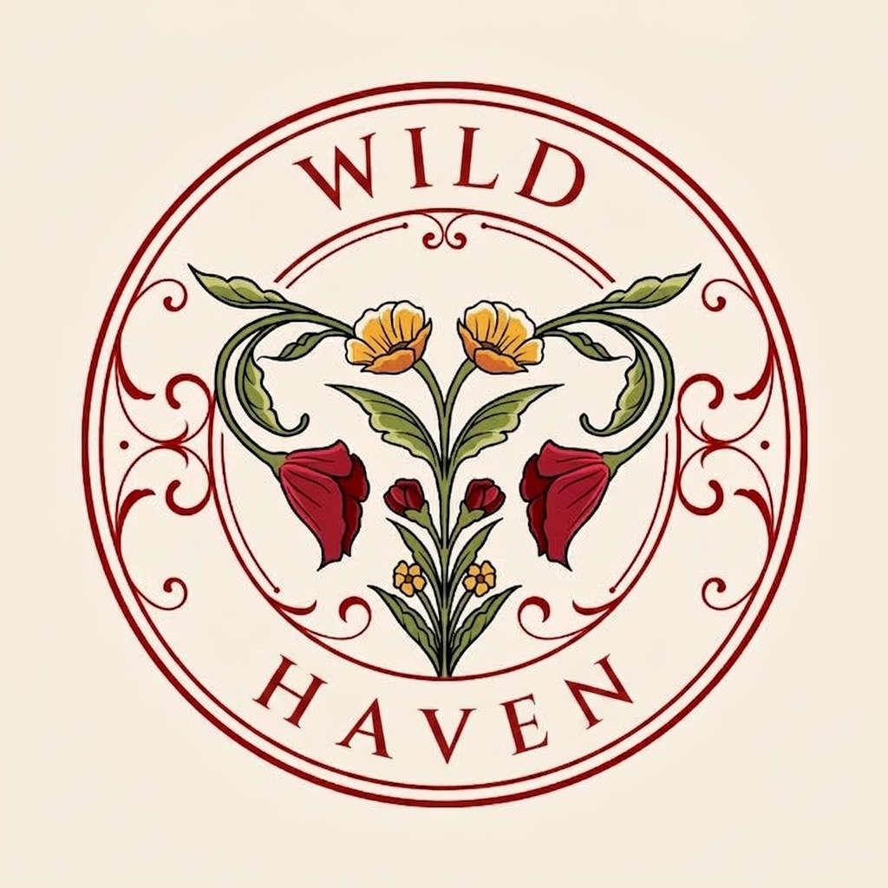

# Wild Haven Website – Demo Walkthrough (Detailed)

## Project Links

- **Front-end:** https://preview--wild-haven-india.lovable.app/
- **Back-end:** https://wild-haven-employee-portal--megandz07.replit.app/
- **Database:** https://91000165-6a67-46be-9e1d-ea59c6248bde-00-3ql7zcuza5n44.sisko.replit.dev/
  
## What it is
Wild Haven is a donation and awareness website for a wildlife conservation NGO (a demo brand created for this project), built using **Lovable AI** — a tool that generates functional websites from prompts. The site's purpose is twofold: educate visitors about India's endangered wildlife and the threats they face, and convert that awareness into actual donations through a smooth, guided flow. Below is a walkthrough of every component, with its features explained directly underneath it.

## 1. Navbar (Our Mission / Impact / FAQ / Donate)
The navigation bar sits fixed at the top of every page and contains the Wild Haven logo/name on the left and four links/buttons on the right: **Our Mission, Impact, FAQ,** and a highlighted **Donate** button.

**Features:**
- Clicking "Our Mission," "Impact," or "FAQ" does **not load a new page** — instead, the browser **smoothly scrolls down** to that specific section on the same homepage. This is called anchor navigation (visible in the URL as `#mission`, `#impact`, `#faq`).
- Because there's no full page reload, the transition feels instant and keeps the user in context.
- The "Donate" button in the navbar is always visible, so no matter where the user scrolls, they can jump straight to donating.
- The navbar stays consistent across every sub-page (campaign pages, payment page), giving the site a unified feel, though sub-pages replace the nav links with a simple "← Back home" button for easier return navigation.

---

## 2. Homepage Hero Section
This is the first thing a visitor sees. It has a large emotional headline ("Give a home to India's wild"), a soft background photo of wildlife, a short paragraph about the threats animals face (poaching, habitat loss, climate change), and two call-to-action buttons: "Donate Now" and "Learn More."

**Features:**
- Below the headline, three **impact statistics** are displayed prominently: 1.2M+ acres protected, 48 rescue missions, 12k supporters. These numbers build credibility and trust immediately, before asking for money.
- The "Donate Now" button scrolls/links directly into the donation widget, reducing friction for someone ready to give right away.
- "Learn More" is aimed at visitors who want context first — it would guide them toward the Mission section.

---

## 3. Donation Widget (Right side of homepage)
This is a compact, self-contained donation form that sits alongside the hero section, so it's visible without scrolling.

**Features:**
- **One-Time vs. Monthly toggle** — lets the donor choose whether this is a single donation or a recurring monthly one.
- **Preset amount buttons** (₹500, ₹1,000, ₹2,500, ₹5,000, ₹10,000, ₹25,000) — one click selects an amount, and it's visually highlighted (outlined in red) to confirm the selection.
- **Custom amount field** — for donors who want to give an amount not listed.
- **Live "Your gift" summary box** — updates instantly as soon as an amount is picked, showing the exact figure (e.g., "₹2,500") along with a note that it's eligible for 50% tax exemption under Section 80G of the Income Tax Act. This reassures Indian donors about the legal/tax benefit of giving.
- **"Continue to Donate" button** at the bottom — this is what actually moves the user forward into the payment process (explained in section 7).

---

## 4. Our Mission Section
This section (reached either by scrolling or clicking "Our Mission" in the navbar) explains the organization's purpose in more depth.

**Features:**
- Headline: "A living haven for the wild things worth saving," followed by a paragraph explaining Wild Haven's geographic scope — from the Sundarbans mangroves to the Himalayan foothills.
- A **transparency statement**: "92 paise of every rupee you give goes directly to conservation work on the ground" — this is a trust-building feature, showing donors exactly how their money is used.
- Two highlighted sub-categories are shown as cards: **Species Protection** (tigers, elephants, snow leopards, etc.) and **Habitat Restoration** (reviving forests, rivers, wetlands) — each is clickable and leads to more detail (see section 6 for Habitat Restoration's dedicated page).
- A large accompanying photo (sunlight through forest canopy) reinforces the emotional, nature-focused branding.

---

## 5. Impact Section
This section is where the NGO shows donors exactly what specific amounts of money accomplish, broken into three concrete "giving tiers."

**Features:**
- **Guard a Snow Leopard – ₹1,000** — funds one week of high-altitude patrols in the Himalayas.
- **Rescue an Elephant – ₹5,000** — provides emergency veterinary care and safe relocation.
- **Restore One Acre – ₹25,000** — funds reforestation of native trees in a degraded area.
- Each card has a **"See progress & give →" link**, which is one of the most interactive parts of the site: clicking it takes the user to a **completely separate, dedicated page** for that specific cause (not just a popup or expanded section).

### Example: "Guard a Snow Leopard" dedicated page
When clicked, this opens a new page (`/impact/snow-leopard`) that includes:
- A longer description of the cause (fewer than 500 snow leopards left in India, why patrols matter)
- Supporting stats: ~500 individuals remaining, 12,400 km² of range protected, 38 guards funded this year
- A **live campaign progress tracker** showing:
  - **67% funded**
  - **Raised: ₹16.9 L**
  - **Goal: ₹25.0 L**
  - **Still needed: ₹8.2 L**
- A note that progress is "updated weekly" and that "92% goes to programs"
- Suggestions for other causes at the bottom (Rescue an Elephant, Restore One Acre), encouraging the donor to explore further even after landing on one page

This shows the site isn't a single static donation form — each cause functions like its own mini-campaign page with real tracked data.

---

## 6. Habitat Restoration Page (Program Page)
Similar to the snow leopard page, this is a separate dedicated page (`/programs/habitat-restoration`) reached by clicking on the "Habitat Restoration" card from the Mission section.

**Features:**
- Headline: "Habitat Restoration – Reviving forests, rivers and wetlands"
- Explains the reasoning: "A tiger without a forest is a tiger without a future," covering restoration work from Sundarbans mangroves to Western Ghats rainforests
- Three stat cards: **1.2M acres under restoration, 4.8M native trees planted, 31 wetlands revived**
- A "← Back home" button to easily return to the main site

This confirms the site supports **multiple structured program pages**, not just one generic "donate" button — each cause/program has its own content, stats, and framing.

---

## 7. FAQ Section
Positioned near the bottom of the homepage, this addresses common donor hesitations before they commit to giving.

**Features:**
- Questions include: "Is my donation tax-deductible?", "How is my money used?", "Can I cancel my monthly donation?", "Do you accept international donations?"
- Each question uses an **accordion/expandable format** — clicking the "+" icon expands the answer inline, keeping the page uncluttered until the user wants more information.
- This is a common UX pattern for trust-building on donation sites, since it answers objections right before the "ask."

---

## 8. Payment Page
This is the final step, reached after clicking "Continue to Donate" from the homepage donation widget.

**Features:**
- The selected amount and frequency are **carried over automatically** via the URL (e.g., `/payment?amount=2500&frequency=one-time`), so the user doesn't have to re-enter anything — it shows "One-time gift of ₹2,500" pre-filled at the top.
- Two payment method tabs:
  - **Card** — fields for Name on Card, Card Number, Expiry (MM/YY), and CVV
  - **UPI/QR** — switching to this tab **dynamically generates a QR code** on the right side of the screen, along with a unique **Transaction ID** (e.g., WH-RULEMZCW) and a **UPI handle** (wildhaven@upi), so the donor could scan it with a banking app to pay
- A **"Pay ₹2,500"** button at the bottom confirms the donation
- A disclaimer at the bottom clearly states: **"This is a demo checkout. No real payment is processed"** — confirming this is a functional prototype built for demonstration, not a live payment gateway

---

## Summary Table of All Interactive Features

| Component | Interactive Feature |
|---|---|
| Navbar | Scroll-to-section navigation (no page reload) |
| Hero Section | Stats build trust; CTA buttons guide user flow |
| Donation Widget | Live-updating amount selection + One-Time/Monthly toggle |
| Our Mission | Clickable cards linking to deeper program pages |
| Impact Section | Each cause opens its own page with live progress tracking |
| Habitat Restoration Page | Dedicated stats and content, separate from homepage |
| FAQ | Expandable accordion answers |
| Payment Page | Auto-filled amount, QR code generation, dual payment methods |

## Database (Operations Dashboard)

A behind-the-scenes look at the internal Operations Dashboard — the tool built to sit closest to Wild Haven's actual data, and the piece that gives the clearest window into how the backend is shaping up.

**1. Dashboard (Home View)**
The landing screen is titled "Operations Dashboard," subtitled "Overview of current conservation funding and activities." It presents two panels side by side: a **Funding Trajectory** card, intended to chart monthly donation totals across the past year, and a **Recent Activity** feed, meant to surface the latest donations and campaign updates across the organization. At this stage of the build both panels are still empty shells — the chart area is blank and Recent Activity simply reads "No recent activity" — but the framing makes the intent obvious: this is designed to be the first thing a staff member checks each morning, a single glance at how funding is trending and what just happened across the org. A persistent left sidebar — Dashboard, Donations, Campaigns, Donors — with an "Operations Control" label pinned at the bottom, anchors every screen and never disappears as you navigate.

**2. Donations**
Clicking "Donations" in the sidebar changes the URL from the root path to `/donations` and swaps the main panel to a **Donations Ledger**, described as a place to "manage and track incoming contributions." The screen includes a search bar ("Search by name or email…"), a status filter dropdown defaulting to "All Statuses," and a green "Add Record" button in the top right for manually logging a new contribution. Below that sits a table with columns for Donor, Amount, Campaign, Date, Status, and Actions. Right now every row is a grey shimmer placeholder rather than real data — which is actually useful information on its own, since it confirms the table is fully wired to expect and display live records the moment a backend data source is connected, rather than being a static mockup.

**3. Campaigns**
Heading back to the sidebar and clicking "Campaigns" updates the URL to `/campaigns` and loads "Active Campaigns," subtitled "Monitor fundraising efforts and conservation targets." An "All Campaigns" dropdown allows filtering, and a prominent "New Campaign" button lets staff spin up a new fundraising push directly from this screen. Beneath that is a grid of six empty campaign cards, clearly structured to eventually hold individual campaign summaries — most likely name, fundraising target, amount raised so far, and current status — once real campaigns are added.

**4. Donors**
One more sidebar click, this time on "Donors," updates the URL to `/donors` and loads the **Donor Directory**, "manage relationships with your supporters." The layout mirrors the Donations Ledger closely: a search bar, an "Add Donor" button, and a table with columns for Donor Profile, Total Contribution, number of Donations, Last Active date, and an Action column. As with the other tables, the rows are currently shimmer placeholders rather than populated entries, reinforcing that this is a live, backend-fed screen waiting on real donor records.

**5. Inferred Database Structure**
Walking through all four screens back-to-back reveals a clean, repeating pattern: every sidebar click updates the URL to a dedicated path and swaps in a matching view, while the sidebar and header stay fixed in place. That's a classic app-shell architecture — a single persistent layout wrapping several route-specific pages. The subdomain hosting this dashboard is named `blank-python`, a strong signal that a Python-based backend framework, likely Flask or FastAPI, is handling the routing and will eventually serve real data into these tables and the dashboard's chart. Based on the shape of the three management tables, the underlying schema most likely includes:
   - `donations` — linked to both a donor and a campaign, storing amount, date, and status
   - `campaigns` — name, fundraising target, amount raised, and status
   - `donors` — profile details, total contribution, donation count, and last-active timestamp

   The "Add Record," "New Campaign," and "Add Donor" buttons confirm the backend is built to support Create operations at minimum, and the "Actions" column on the Donations table strongly suggests Edit and Delete capability is part of the same plan — pointing toward a full CRUD system rather than a read-only reporting view.
   
## Summary Table: Interactive Features — Database (Operations Dashboard)

| Screen | Interactive Feature | Type | Function |
|---|---|---|---|
| Dashboard | Sidebar navigation (Dashboard/Donations/Campaigns/Donors) | Navigation | Routes to dedicated URL paths, swaps main content pane |
| Dashboard | Funding Trajectory chart | Data display | Shows monthly donation totals over the past year |
| Dashboard | Recent Activity feed | Data display | Lists latest donations and campaign updates |
| Donations | Search bar (name/email) | Input/filter | Searches donation records by donor name or email |
| Donations | "All Statuses" dropdown | Filter | Filters ledger by donation status |
| Donations | "Add Record" button | Action | Opens flow to manually log a new donation |
| Donations | Donations table (Donor/Amount/Campaign/Date/Status) | Data display | Lists all contribution records |
| Donations | Actions column (per row) | Action | Implied edit/delete on individual donation records |
| Campaigns | "All Campaigns" dropdown | Filter | Filters campaign grid by category/status |
| Campaigns | "New Campaign" button | Action | Opens flow to create a new fundraising campaign |
| Campaigns | Campaign cards grid | Data display | Shows individual campaign summaries (name, target, progress) |
| Donors | Search bar (name/email/phone) | Input/filter | Searches donor directory |
| Donors | "Add Donor" button | Action | Opens flow to manually add a new donor profile |
| Donors | Donor table (Profile/Contribution/Donations/Last Active) | Data display | Lists all donor relationship records |
| Donors | Action column (per row) | Action | Implied edit/delete/view on individual donor profiles |

### Feature Category Breakdown
- **Navigation (1):** Sidebar routing across four screens
- **Input/Filter (4):** Search bars and status/campaign dropdowns
- **Action/CRUD (5):** Add Record, New Campaign, Add Donor, and per-row Actions across two tables
- **Data Display (5):** Chart, activity feed, and three management tables
---

## Employee Portal (Backend Access)

A separate, staff-facing application hosted on its own subdomain — positioned as the intended front door into the internal tools documented above, rather than a tool in itself.

**1. Landing Page**
The portal's landing page is styled quite differently from the utilitarian Operations Dashboard — a polished maroon-and-cream design paired with serif display type, headlined "Good work needs a clear view." The page frames the portal as "a private workspace for the people turning every gift into protected habitat, safer journeys, and a future for the species we share this place with." A featured card carries a quote attributed to "Dr. Amara Okafor, Field Director" — "Conservation is a long conversation with the land" — alongside a headline statistic, "14.8k acres in care," and an "est. 1998" badge, both used to reinforce organizational scale and credibility to staff logging in. A "Staff sign in" link and an "INTERNAL OPERATIONS WORKSPACE" label at the top right make clear the application is access-restricted rather than public.

**2. Sign-In Flow**
Clicking "Enter the staff portal" leads to a dedicated sign-in screen, branded "Welcome back — your field desk is waiting." Two entry paths are offered: **Continue with Google**, a federated OAuth option likely tied to organizational Google accounts, and a fallback **email address + Continue** flow, with a visible "Don't have an account? Sign up" link for staff or contractors without an existing login.

**3. Relationship to the Database/Dashboard**
As it stands, the Employee Portal and the Operations Dashboard appear to be separately hosted and not yet visibly wired together — each lives on its own subdomain with no confirmed handoff between them. The natural next step in development would be for a staff member to authenticate once through this portal and be routed directly into the dashboard's Donations, Campaigns, and Donors screens, rather than reaching that dashboard through its raw, currently-public Replit URL.

**4. Implied Backend Behavior**
Donors never encounter a login anywhere on the public donation site, while staff have a dedicated, two-path authentication flow here — a strong signal that the system is being designed around **role-segregated access** from the outset. This suggests the finished backend will most likely gate the Donations/Campaigns/Donors screens behind an authenticated staff session, with Google OAuth and/or email-based accounts determining who is allowed in, separating donor-side data flow from staff-side management entirely.

## Summary Table: Interactive Features — Employee Portal (Backend Access)

| Screen | Interactive Feature | Type | Function |
|---|---|---|---|
| Landing Page | "Enter the staff portal" button | Navigation | Leads to sign-in screen |
| Landing Page | "Staff sign in" link | Navigation | Alternate entry point to sign-in screen |
| Sign-In | "Continue with Google" button | Authentication | OAuth-based federated sign-in |
| Sign-In | Email address field + "Continue" button | Authentication | Email-based sign-in flow |
| Sign-In | "Sign up" link | Authentication | Routes new staff/contractors to account creation |

### Feature Category Breakdown
- **Navigation (2):** Landing page entry points into the sign-in flow
- **Authentication (3):** Google OAuth, email sign-in, sign-up
