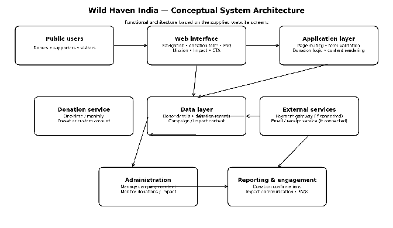
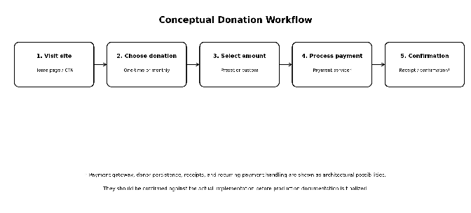

#  W
i
ld Haven India
### Website System Architecture & Functional Overview

*Documentation draft • Version 1.0*

---

## Table of Contents

1. [Scope and Source Basis](#-scope-and-source-basis)
2. [Website Overview](#1-website-overview)
3. [User Details](#2-user-details)
4. [Site Structure](#3-site-structure)
5. [System Architecture](#4-system-architecture)
6. [Architecture Components](#5-architecture-components)
7. [Donation Workflow](#6-donation-workflow)
8. [Functional Data Flow](#7-functional-data-flow)
9. [Content Architecture](#8-content-architecture)
10. [Security and Privacy Considerations](#9-security-and-privacy-considerations)
11. [Recommended Technology Layers](#10-recommended-technology-layers)
12. [Accessibility and Usability](#11-accessibility-and-usability)
13. [Deployment and Operational Considerations](#12-deployment-and-operational-considerations)
14. [Known Assumptions and Items to Verify](#13-known-assumptions-and-items-to-verify)
15. [Summary](#14-summary)
16. [Source](#-source)

---

##  Scope and Source Basis

This document explains the Wild Haven India wildlife-conservation donation website
from a **functional and conceptual architecture** perspective. It is based on the 
supplied website screenshots and the visible user interface:
This includes the home/donation experience.
It includes Our Mission content.
It includes Impact cards.
It includes the donation call-to-action.
It includes the FAQ section.
It includes footer contact information.

 ** Important:** The screenshots do not expose the underlying source code.
> They do not expose the database schema.
> They do not expose the APIs in use.
> They do not expose the payment provider.
> They do not expose the hosting configuration.
> They do not expose the authentication implementation.
> Where these implementation details are not visible, the architecture below is explicitly described as **conceptual or recommended** rather than confirmed.
> This distinction matters because conceptual architecture describes what a system like this typically needs.
> It does not claim to describe what has actually been built behind the scenes.
> Readers should treat every "recommended" label in this document as a design suggestion, not a verified fact.

---

## 1. Website Overview

Wild Haven is presented as a nonprofit wildlife-conservation website focused
on encouraging donations and showing donors how their contributions support 
conservation activities in India. The site combines storytelling,
impact information, FAQs, and a prominent donation experience.

| Area | Description |
|---|---|
| **Primary purpose** | Inform visitors about wildlife conservation and convert interested visitors into donors. |
| **Primary action** | Make a one-time or monthly donation. |
| **Supporting content** | Mission, conservation programs, measurable impact, donation-use examples, and FAQs. |
| **Target geography** | India, with content referring to Indian wildlife and ecosystems. |
| **Primary audience** | Individual donors and supporters interested in wildlife conservation. |
| **Secondary audience** | Corporate sponsors or CSR partners who may want to fund specific campaigns. |
| **Tertiary audience** | Volunteers or field partners who may land on the site looking for involvement opportunities. |
| **Communication style** | Mission-led, trust-oriented, visual, and donation focused. |
| **Brand tone** | Warm, urgent-but-hopeful, rooted in conservation storytelling rather than statistics alone. |
| **Content cadence** | Appears to be a mostly static content structure rather than a frequently-updated blog or news feed. |

---

## 2. User Details

The visible experience supports several user types.
The following roles are **functional personas**
They are not necessarily authenticated roles in the current implementation.
Personas are a useful way to reason about a site's design even when no login system exists yet.

| User Type | Needs / Actions |

| User Type | Needs / Actions |
|---|---|
| **Visitor / prospective donor** | Browses the mission and impact information, reviews FAQs, and decides whether to contribute. |
| **One-time donor** | Selects a one-time contribution amount, including preset or custom amounts, and completes the donation journey. |
| **Monthly donor** | Selects recurring/monthly giving and completes the recurring donation journey, subject to the payment implementation. |
| **Existing supporter** | Uses the site to understand how contributions are used and revisit impact information. |
| **NGO / content administrator** | Recommended administrative role for maintaining mission, impact, FAQ, campaign, and donation-related content. |

---

## 3. Site Structure

-  **Home / donation section** — introduces the conservation mission and presents the primary donation form.
-  **Our Mission** — explains Wild Haven's conservation approach, including species protection, habitat restoration, anti-poaching, and community programs.
-  **Impact** — connects contribution amounts to tangible conservation outcomes such as patrols, rescue support, and habitat restoration.
-  **FAQ** — answers common donor questions about tax deductibility, use of funds, monthly-donation cancellation, and international donations.
-  **Donation call-to-action** — provides repeated entry points into the donation experience.
-  **Footer** — provides organizational description, navigation links, email, phone, and location information.
Each of these sections is worth examining individually for its functional role.
The Home section functions as both a landing page and a conversion funnel entry point.
Our Mission functions as a trust-building layer, establishing legitimacy before asking for money.
Impact functions as social proof, translating abstract donations into concrete outcomes.
FAQ functions as an objection-handling layer, addressing hesitations that could otherwise stall a donation.
The repeated donation call-to-action functions as a conversion safety net,
catching visitors at multiple scroll depths.
The footer functions as a credibility and contactability layer,
 reassuring visitors the organization is reachable and real
---

## 4. System Architecture

At a conceptual level, the website follows a
**layered web-application architecture**.
Visitors interact with a browser-based presentation layer. 
The application layer controls page navigation
It also controls donation-form behavior.
It also controls validation.
A data layer can persist donation and content information, 
while external services can handle payment processing and donor communications.

This layered separation is a common pattern because it isolates concerns.
Changes to the visual design should not require changes to how donations are processed.
Changes to the payment provider should not require changes to how content is displayed.
This separation also makes the system easier to secure, since sensitive operations (like payments) can be isolated from the more exposed presentation layer.

  

<b>Figure 1.</b> Conceptual system architecture based on the visible website functionality.

---

## 5. Architecture Components

Each architectural layer maps to a specific
responsibility within the system.
The table below expands on each component 
and what it is expected to handle.

| Component | Responsibility |
|---|---|
| **Presentation layer** | Responsive web pages, navigation, donation controls, content sections, cards, FAQ accordions, buttons, and calls to action. |
| **Application layer** | Routes users between the Home, Mission, Impact, and FAQ experiences; manages donation-form state and validation; renders content. |
| **Donation module** | Supports one-time and monthly giving, preset amounts, custom amount entry, and a summary of the selected contribution. |
| **Data layer** | Recommended storage for donor/donation records and editable website content. The exact database is not visible in the supplied screens. |
| **Payment integration** | Recommended external payment service for securely processing donations. The specific provider and API are not visible and must be confirmed from the implementation. |
| **Communication layer** | Optional service for receipts, confirmations, donor notifications, or campaign communication. |
| **Administration layer** | Recommended protected interface for maintaining FAQs, mission/impact content, donation campaigns, and reviewing donation records. |

Each of these components could, in principle, be implemented as a separate service.
Alternatively, several of them could be combined into a single monolithic application,
especially at this stage of the project's maturity.
The choice between a monolith and separate services usually depends on team size, 
expected traffic, and how quickly new features need to ship.

---

## 6. Donation Workflow

The donation interface is the central transactional component visible in the screenshots.
It allows a visitor to switch between one-time and monthly giving
It allows a visitor to select a predefined amount, 
It allows a visitor to enter a custom amount. 
The UI then displays the selected gift before the visitor proceeds with the transaction.

This workflow is deceptively simple on the surface but implies meaningful underlying state management.
Switching between "one-time" and "monthly" likely changes which preset amounts are shown, 
since suggested monthly amounts are typically smaller than one-time amounts.
Selecting a custom amount likely overrides any preset selection, requiring the UI
to track which input source is currently authoritative.
The summary view before checkout implies a confirmation step exists prior to
actual payment submission, which is good practice for reducing accidental donations.

   

<b>Figure 2.</b> Conceptual donation workflow.

---

## 7. Functional Data Flow

1. Visitor opens the website and reads mission/impact content.
2. Visitor selects **Donate** or a donation call-to-action.
3. Donation module records the selected frequency and amount in the active form state.
4. The application validates the amount and required donor/payment information.
5. The payment service processes the transaction, if integrated.
6. The system receives the payment result and displays confirmation.
7. Donation information can be persisted for reporting, reconciliation, tax receipts, and donor communication, depending on the implemented backend.

---

## 8. Content Architecture

Content on the site can be grouped into a small number of distinct types.
Each content type likely has its own editing and storage needs if 
an administration layer is built.

| Content Type | Purpose |
|---|---|
| **Mission content** | Organization purpose, ecosystems, species protection, habitat restoration, anti-poaching, and community programs. |
| **Impact content** | Donation amounts mapped to outcomes, such as snow-leopard patrols, elephant rescue, and habitat restoration. |
| **FAQ content** | Frequently asked donor questions and expandable answers. |
| **Campaign content** | Donation headline, supporting message, suggested amounts, tax-related messaging, and calls to action. |
| **Organization content** | Organization description and contact details displayed in the footer. |

If an administration layer is eventually built, each content type above
would likely correspond to its own editable content model.
Mission and Organization content would probably change infrequently.
Campaign content would likely change often, especially around 
specific fundraising pushes or seasonal appeals.

---

## 9. Security and Privacy Considerations

> The following are **recommended** architecture requirements for a production donation platform.
> They are not claims that each control is already implemented.

-  Process card/payment information through a compliant payment provider rather than storing raw payment credentials in the website database.
-  Use HTTPS for all pages and API communication.
-  Validate donation amounts on both the client and server sides.
-  Protect administrative functions with authentication and role-based authorization.
-  Restrict access to donor records using least-privilege permissions.
-  Store only the donor information required for donation processing, receipts, compliance, and communication.
-  Log transaction status and application errors without exposing sensitive payment data.
-  Protect recurring-payment operations with provider-side controls and secure webhook verification.
-  Rate-limit the donation endpoint to reduce the risk of automated abuse or card-testing fraud.
-  Rotate any API keys or secrets used for payment or email integrations on a regular schedule.
-  Ensure donor data is not exposed through public APIs or unauthenticated admin routes.
-  Maintain an incident-response plan in case of a suspected data breach involving donor information.

  Security for a donation platform is especially sensitive because
  it touches both **financial data** and **personal data** simultaneously.
A breach affecting either category could damage donor trust significantly,
which is the organization's most valuable long-term asset.

---

## 10. Recommended Technology Layers

> Because the underlying source code was not supplied, the following table describes **technology categories** rather than asserting specific products.

| Layer | Technology Category | Purpose |
|---|---|---|
| **Client** | Modern responsive web framework | Render pages and handle interactive UI. |
| **Styling** | CSS / component styling system | Responsive layout, typography, colors, cards, and controls. |
| **Application** | Web application / API layer | Donation logic, validation, routing, and business rules. |
| **Database** | Relational or managed cloud database | Persist donations, campaign content, FAQs, and operational records. |
| **Payments** | PCI-compliant payment gateway | Secure one-time and recurring payment processing. |
| **Hosting** | Managed web hosting / cloud platform | Deploy and serve the website and application services. |
| **Notifications** | Email/notification service | Send donation confirmations, receipts, and operational messages. |

---

## 11. Accessibility and Usability

-  Provide keyboard-accessible navigation and controls.
-  Use semantic headings and landmarks for the:
   Mission
   Impact
    FAQ
   and footer sections.
-  Ensure FAQ expand/collapse controls expose their state to assistive technologies.
-  Provide accessible labels and error messages for donation amount fields.
-  Maintain sufficient text contrast and visible focus states.
-  Ensure donation controls and navigation remain usable on mobile and tablet screen sizes.
-  Avoid relying on color alone to indicate selected donation frequency (one-time vs. monthly).

---

## 12. Deployment and Operational Considerations

A production deployment should separate the public web experience from 
privileged administration and payment operations. 
Environment-specific configuration should be stored securely. 
Payment callbacks/webhooks should be validated server-side, and 
application monitoring should track errors and failed transactions.
A staging environment should exist so that content and feature changes
can be tested before reaching real donors.
Backups of the donation and donor database should be taken on a regular,
automated schedule.
A rollback plan should exist in case a deployment introduces a critical 
donation-flow bug.
Deployment changes affecting the payment flow should ideally be reviewed more 
carefully than changes to purely visual content.

---

## 13. Known Assumptions and Items to Verify

- [ ] Exact frontend framework and version.
- [ ] Exact backend framework or serverless architecture.
- [ ] Database provider and database schema.
- [ ] Payment gateway/provider and supported payment methods.
- [ ] Whether monthly donations are implemented as recurring subscriptions or another mechanism.
- [ ] Whether donor accounts/authentication exist.
- [ ] Whether an administrator dashboard exists.
- [ ] Email provider and tax-receipt generation mechanism.
- [ ] Hosting/deployment platform and CI/CD workflow.
- [ ] Analytics, monitoring, logging, and backup strategy.

---

## 14. Summary

Wild Haven India is a donation-oriented conservation website designed around a simple user journey:

**understand the mission → see measurable impact → choose a contribution → donate**

Its visible architecture can be documented as a presentation layer backed by
application and donation services, with data storage and external payment/communication 
services forming the transactional foundation. The exact implementation architecture should
be updated after reviewing the project's source code and deployment configuration.

---
## 15. Additional Insights

Beyond the visible interface, three observations stand out. First, the donation module's dual-mode design 
(one-time vs. monthly) suggests state-management complexity not obvious from screenshots alone — toggling
frequency likely re-renders amount presets and summary text dynamically, meaning the donation form probably 
holds shared state across frequency, amount, and custom-input fields. Second, the site's content sequencing 
(Mission → Impact → FAQ → Donate) mirrors a standard nonprofit conversion funnel: build awareness, establish 
credibility, demonstrate measurable outcomes, then prompt action — this ordering is a deliberate UX choice, not
incidental layout. Third, the absence of visible donor accounts implies donations are likely processed as guest 
checkouts, simplifying UX but limiting repeat-donor personalization and requiring email-based receipts instead of 
account history. A future iteration could add a lightweight donor dashboard and campaign-specific landing pages
to improve retention and enable targeted impact reporting, without requiring major architectural changes to the 
existing layered structure.
##  Source

Wild Haven India website preview: **[preview--wild-haven-india.lovable.app](https://preview--wild-haven-india.lovable.app/)**

> **Confidence:** High for the functional/site-structure description visible in the supplied screenshots; moderate for the conceptual architecture; low for any implementation-specific technology, database, payment, or hosting details not visible in the screenshots.

